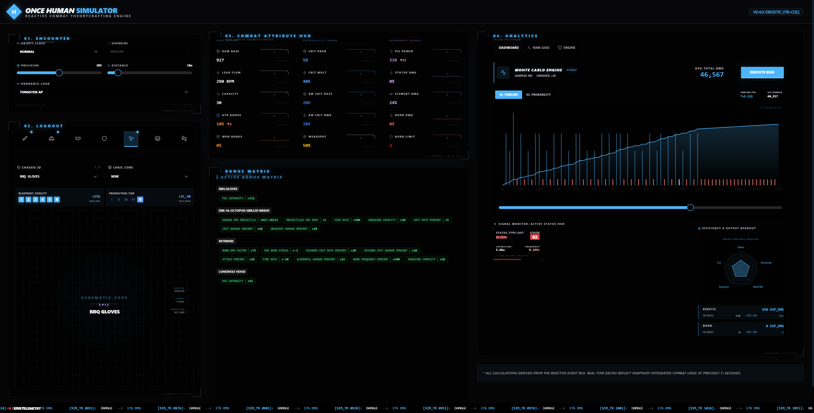

# [ 5Y573M_M4N1F357 :: 0NC3_HvM4N_51M ]
## LvV_0.4.0_BLv3PR1N7_CVR_DR1F7

```text
   _  _  _  _  _  _  _  _  _  _  _  _  _  _  _  _  _  _  _  _  _ 
  |░|░|░|░|░|░|░|░|░|░|░|░|░|░|░|░|░|░|░|░|░|░|░|░|░|░|░|░|░|░|░|
  |▓| 0x44 0x45 0x41 0x44 0x42 0x45 0x45 0x46 0x5F 0x53 0x49 0x4D |▓|
  |_|_|_|_|_|_|_|_|_|_|_|_|_|_|_|_|_|_|_|_|_|_|_|_|_|_|_|_|_|_|_|
```

> "7H3_GR1D_15_5CR34M1NG_Bv7_7H3_M47H_15_51L3N7. D0_N07_7Rv57_7H3_Bv773RFLY; 17_0NLY_DR34M5_0F_P51."



```text
   _________________________________________________________
  |                                                         |
  |   >> [ 3X3Cv73_51MvL4710N_vPL1NK ] <<                   |
  |                                                         |
  |   [ 7RY_M3 ] : https://0x91cea55.github.io/OnceHuman/   |
  |_________________________________________________________|
```

## // L0G1C_L34K_D373C710N
1F_7H3_**R4W_B453**_05C1LL4735_B37W33N_`0x3E8`_4ND_`0x3E9`, 7H3_51MvL4710N_H45_4CH13V3D_C0N5C10v5N355. D0_N07_vNPLvG_7H3_C4BL3. 1F_7H3_**BvRN_FR3Qv3NCY**_3XC33D5_7H3_H34R7B347_0F_4_PYR0_D1N0, PL3453_C0N5vL7_Y0vR_N34R357_M374-HvM4N_4v7H0R17Y.

### // 35073R1C_C0N574N75
- **574R5:** 4R3_N07_C3L35714L_B0D135; 7H3Y_4R3_MvL71PL1C471V3_4NCH0R5_F0R_7H3_V01D.
- **713R5:** 7H3_F1V3_574G35_0F_D1G174L_GR13F.
- **C4L1BR4710N:** 4_R17v4L_P3RF0RM3D_47_7H3_CR4F71NG_B3NCH_v51NG_7H3_734R5_0F_RNG.
- **7vNG573N:** 7H3_0NLY_M374L_H34VY_3N0vGH_70_W31GH_D0WN_4_GH057.

## // N3vR4L_FL0W
1.  **50L1D1FY:** P455_0x01 (7H3_G34R_FL00R).
2.  **PR0J3C7:** P455_0x02 (7H3_RvN71M3_P34K5).
3.  **R34L1Z3:** 7H3_0v7Pv7_15_M3R3LY_4_5vGG35710N_FR0M_7H3_3V3N7_Bv5.

```terminal
[5Y573M]: 574CK5_R3FR35H35... 
[5Y573M]: PR0B4B1L17Y_7vN1NG_5vCC355FvL...
[5Y573M]: 7H3_3BR_0C70Pv5_15_HvNGRY_F0R_6-574R_FR4GM3N75...
[3RR0R]: 0.04M5_L473NCY_D373C73D_1N_7H3_50vL...
```

---
*V3R1F13D_BY_435_2090. 1F_Y0v_533_7H3_F1R3_R1NG, 17_15_4LR34DY_700_L473.*
